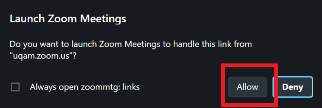
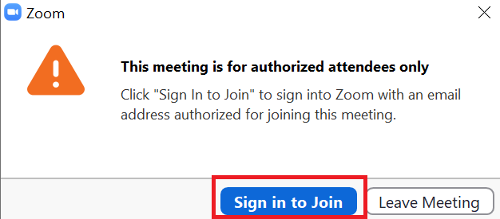
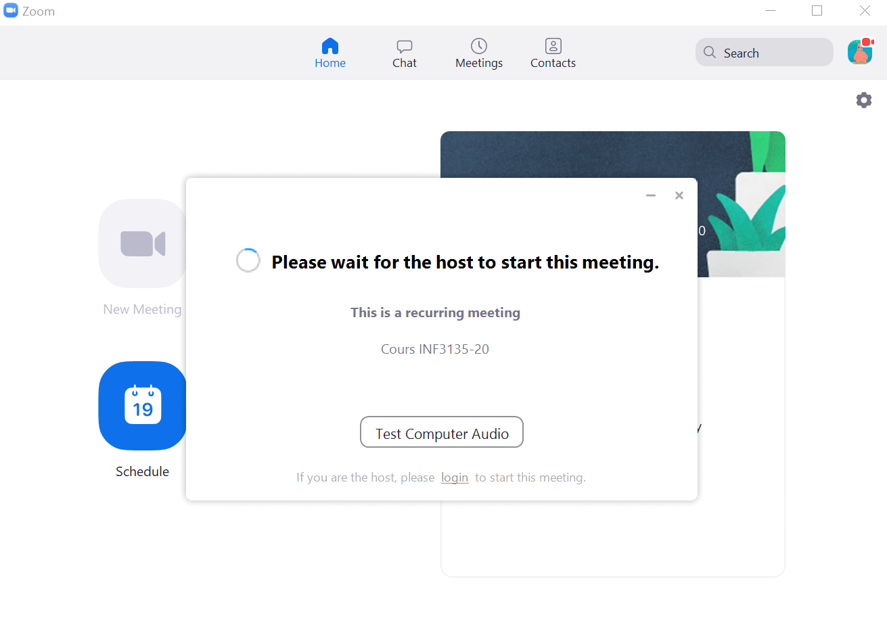
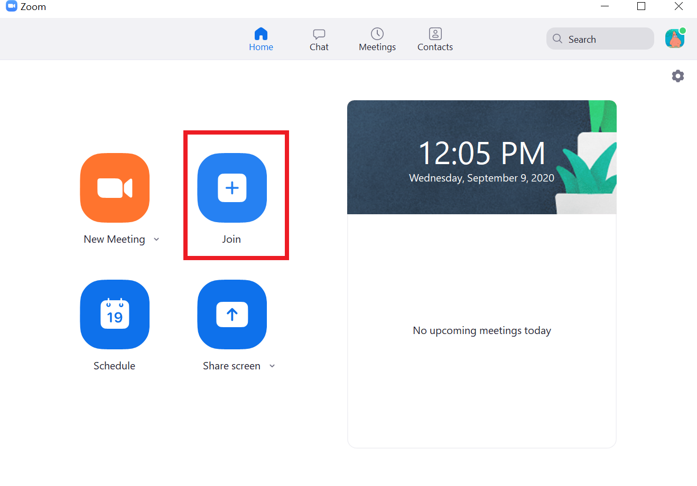
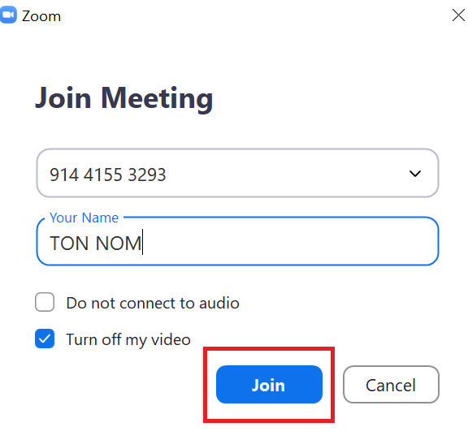
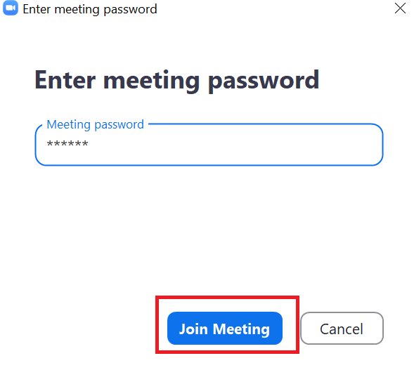

# Zoom - Se connecter à la rencontre

Pour se connecter au Zoom du cours INF3135 il va falloir [installer Zoom](https://zoom.us/support/download).

Vous devrez aussi vous faire un compte Zoom avec votre e-mail de l'UQAM (**xx000000@ens.uqam.ca**). Pour le faire vous pouvez suivre les indications présentes [ici](https://wiki.uqam.ca/pages/viewpage.action?pageId=36457144). En gros, vous devez vous rendre [dans cette page](http://zoom.uqam.ca/), cliquer sur **Configurer** et vous connecter avec votre adresse UQAM et votre mot de passe associé.

Ensuite, vous devez cliquer sur ce [lien-ci](https://uqam.zoom.us/j/91441553293?pwd=R2xSMHJuOUdkM2ZFVUFKWjBTa2pndz09).

Une page Internet s'ouvrira vous demandant de permettre à la rencontre de s'ouvrir, vous cliquez sur *Allow*.

Si vous n'êtes pas connectez avec votre compte UQAM vous devrez vous connecter.

Un fois fait, vous devez attendre que l'enseignant vous accepte.

Vous pouvez aussi ouvrir Zoom, rejoindre une rencontre.

Et entrer le ID de la rencontre (**914 4155 3293**) ainsi que le mot de passe (**593925**).

 

Et, voilà!

