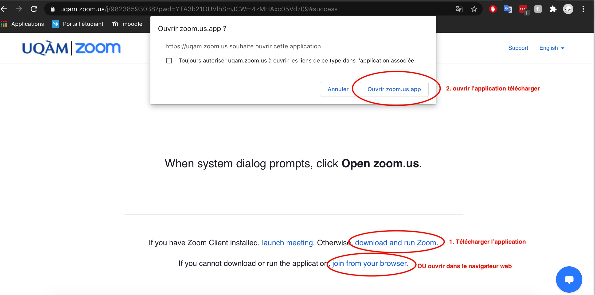

## Procédure de connection à Zoom (par FRES du groupe 40)

###### Pour ce connecter au cours Zoom du cours INF3135 voici quelques marches à suivre méthodes possibles

### 1. Méthode par lien

 1.1 Si ce n'est pas déja fait, créer un compte Zoom avec votre email fourni par l'UQAM avec le lien vers la page web ci-dessous. 

[https://zoom.us/signup](https://zoom.us/signup)

1.2 Pour pouvoir acéder au cours en ligne le jeudi à 13h30, utiliser le liens ci-dessous

[https://uqam.zoom.us/j/98238593038?pwd=YTA3b21OUVlhSmJCWm4zMHAxc05Vdz09](https://uqam.zoom.us/j/98238593038?pwd=YTA3b21OUVlhSmJCWm4zMHAxc05Vdz09)

### 2. Méthode par ID

2.1  Si ce n'est pas déja fait, créer un compte Zoom avec votre email fourni par l'UQAM avec le lien vers la page web ci-dessous.

[https://zoom.us/signup](https://zoom.us/signup)

2.2 Dans l'application ZOOM, ou le site web (lien ci-dessous), cliquer "rejoindre réunion" et utilisés les informations suivantes.

[https://uqam.zoom.us/](https://uqam.zoom.us/)

<u>ID de réunion : 982 3859 3038</u>

### 3. Méthode par Calendrier

3.1 Sur votre appareil de choix, telecharger à l'aide du lien ci-dessous un rappel dans votre calendrier contenant l'heure du cours ainsi que le lien vers la réunion.

 [Lien pour Calendrier](https://uqam.zoom.us/meeting/tJwvdOGtpzgqGdzfMvckWGSzRXchGX6FBB5O/ics?icsToken=98tyKuCgrDgiH92WsBqPRow-AIjCWe_xmHZfjadHmjLzACtkRTDsBNpBOpVHRv7y)

3.2 Suivre les étapes de la méthode 1 

### Attention : 

Si vous n'avez pas l'application Zoom 

Il est possible de l'ouvrire dans votre navigateur Web. 

---
Auteur original FRES 2020-09-09
