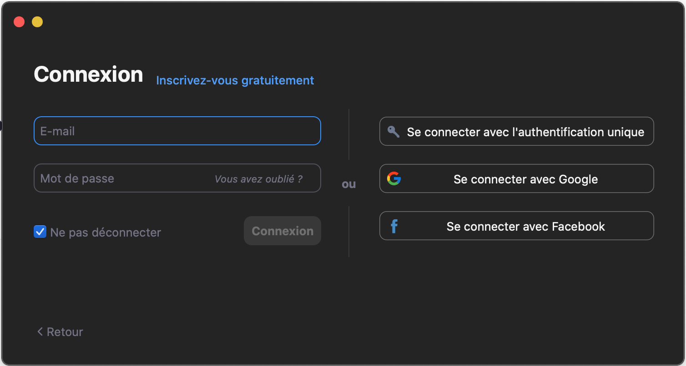
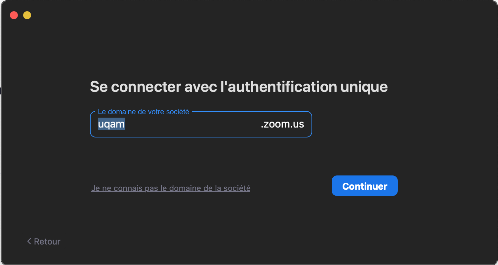
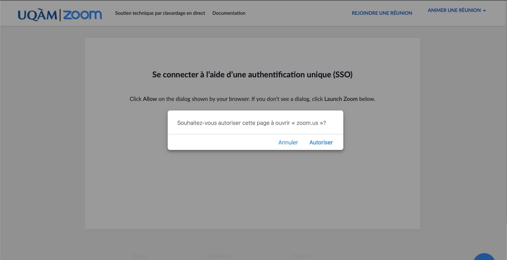
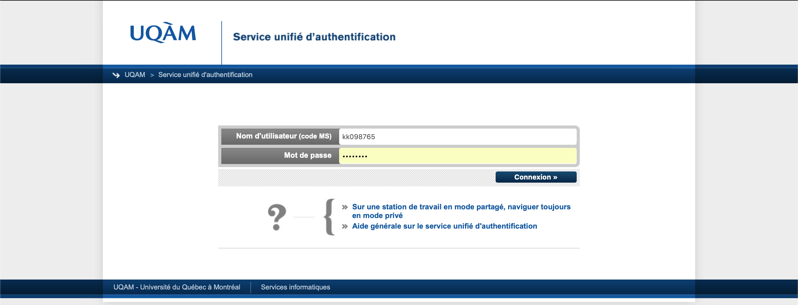
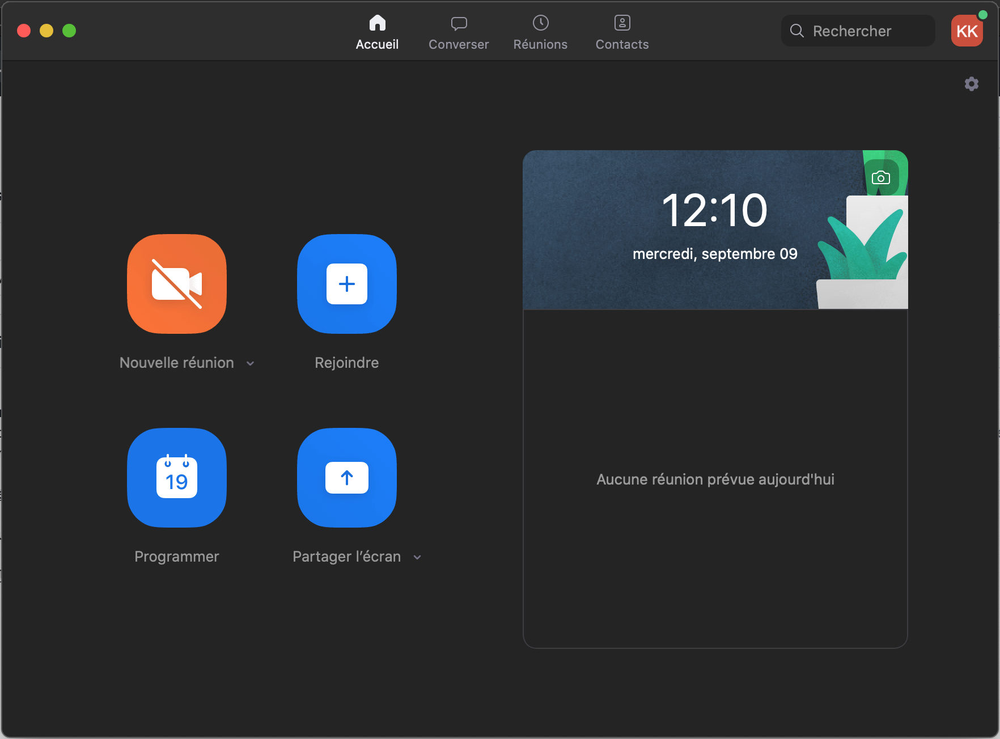
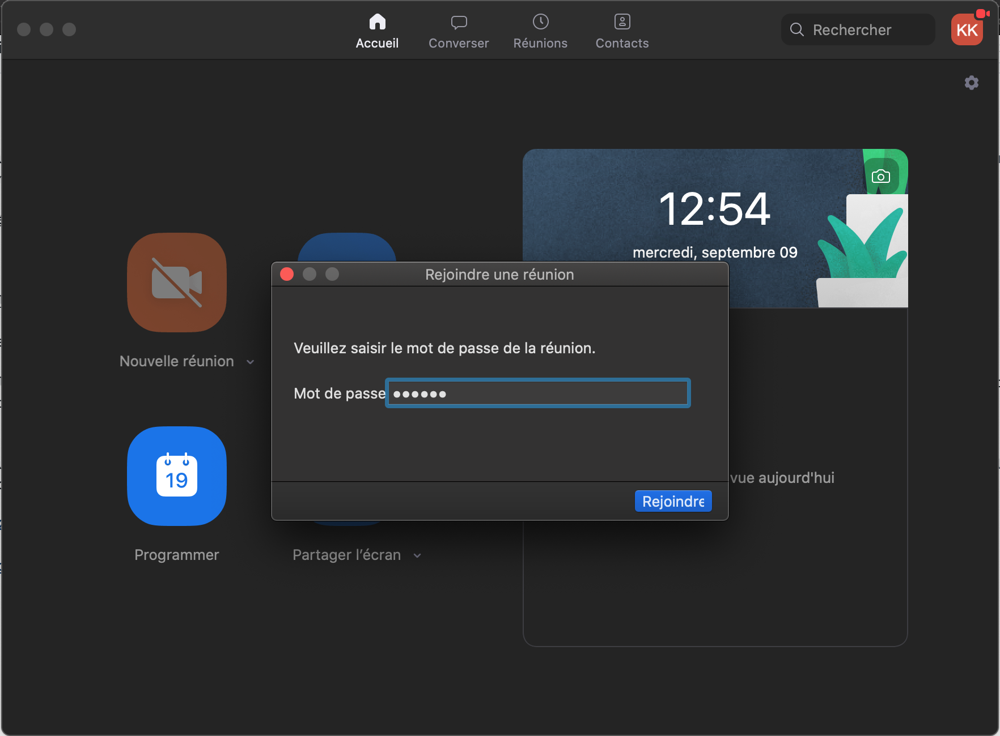
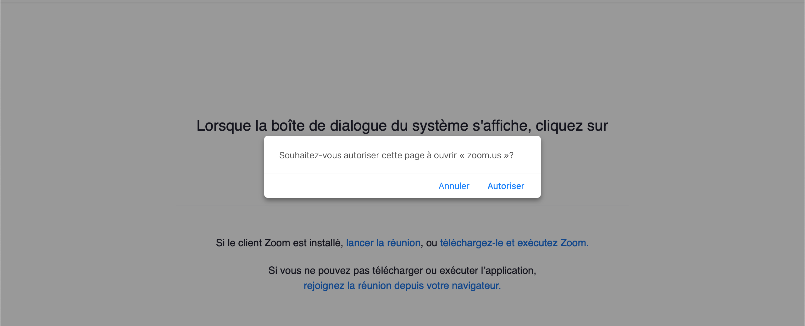
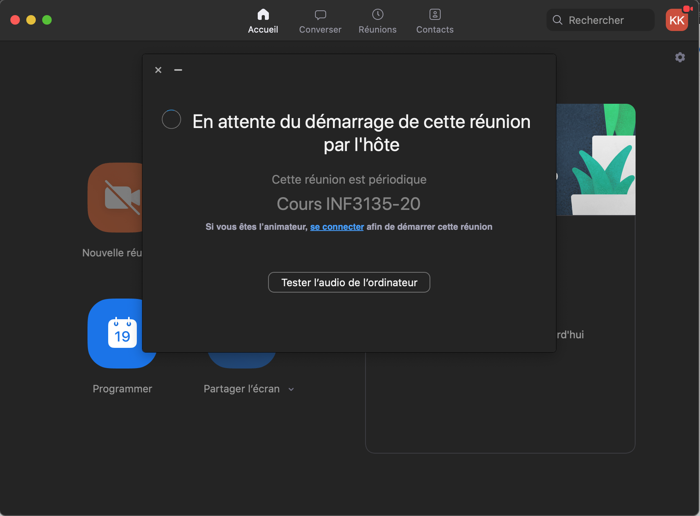

## Procédure de connexion à Zoom (par KADK du groupe 20)

## Connexion : 
- Pour se connecter avec l'authentification unique, Cliquez sur l’icône `se connecter avec l'authentification unique`.

- Entrer le domaine `uqam`

- Une fenêtre avec une boîte de dialogue du système apparaîtra, cliquez sur `Autoriser`.

- Une fenêtre de service unifié d'authentification de l'UQAM apparaîtra, saisissiez le `code MS` et le `Mot de passe`, cliquez sur `connexion`.

## Méthode I :
### Rejoindre une réunion sur Zoom
- Pour rejoindre une réunion sur Zoom Cliquez sur l’icône du logiciel pour le lancer. Dans la fenêtre qui apparaîtra, cliquez sur ` rejoindre ` pour rejoindre une réunion en tant que participant.

- Dans la fenêtre qui apparaîtra, saisissiez l’identifiant de la réunion `914 4155 3293` de la salle de conférence puis écrivez votre nom :

- Si une fenêtre apparaît, on vous demande de rentrer un mot de passe pour rejoindre une réunion, entrée le mot de passe suivant: `XXXXXX`.

NB : Si l’appareil à partir duquel vous vous connectez dispose d’une caméra Web, vous pouvez l’activer en décochant l’option « Arrêter ma vidéo ». Si vous laissez cette option cochée, il vous sera toujours possible de démarrer votre caméra une fois dans la salle.

## Méthode II :
- Pour rejoindre une réunion sur Zoom via un URL, Cliquer sur le lien URL suivant https://uqam.zoom.us/j/91441553293?pwd=R2xSMHJuOUdkM2ZFVUFKWjBTa2pndz09 , lorsque la boîte de dialogue du système s'affiche, cliquez sur Autoriser.

---
Auteur original KADK 2020-09-09
