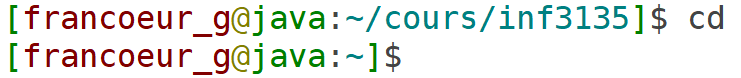

# Atelier 01: Connexion ssh, Éditeurs, Markdown et Git

----
**Note** : (_facultatif_) S'il y a des questions dans ce labo, répondez y dans un fichier nommé
`./labo/reponse-labo-XX.md`. `XX` étant le numéro de l'atelier. Le fichier doit être dans un format `Markdown`. 
Utiliser un projet privé [Voir section 5](#5) nommé `inf3135-a2020` pour déposer le fichier demandé.
Utiliser le même format de fichier pour tous les exercices.

##### Format du fichier Markdown
 + Atelier 01 (Header 1)
 + Exercice {1..n} (H2)
 + Question {1..n} (H4)
 + S`2`.E`3`.Q`1` (strong) `est une valeur qui change bien sûr`
 + La réponse dans une section script (code block)

**Note**: Il est recommandé de versionner vos réponses aux exercices à l'aide
de Git (en ligne de commande). Un seul dépôt est amplement suffisant pour tous les laboratoires.

 > > Pourquoi versionner vos exercices avec Git: afin de
vous entraîner à utiliser le logiciel (les commandes) naturellement.
----

### Objectif de l'atelier : Gagner en aisance avec l'environnement Linux

## 1 - Établir une connexion SSH

Dans le cadre de ce cours, des comptes ont été créés pour chacun d'entre vous
sur le serveur Java (`java.labunix.uqam.ca`). Pour vous y connecter, vous devez
connaître votre identifiant MS (2 lettres suivies de 6 chiffres) ainsi que
votre NIP.

Familiarisez-vous avec les étapes de base pour établir une connexion SSH. Le
mécanisme sera différent selon que vous travaillez sous Windows, Mac OS ou
Linux. Il s'agit d'une partie très importante, car vos deux premiers travaux
pratiques devront minimalement fonctionner sur le serveur Java.

Parfois, certains comptes étudiants ne sont pas activés sur les serveurs, alors
envoyez-moi un courriel si c'est votre cas et le problème devrait être réglé
rapidement.

**Note**: Dans votre vie professionnelle, vous serez confrontés à plusieurs environnements
et votre propre laptop (pc, mac) restera sûrement à la maison.  Dans un environnement
corporatif, vous devez travailler avec les outils et standards de la firme. Linux est très
probablement celui avec lequel vous aurez à travailler.  Habituez-vous maintenant.

## 2a - Vim optionnel (seulement pour ceux qui veulent)

Complétez le tutoriel intégré de Vim. Pour cela, il suffit d'ouvrir un terminal, connecter
le serveur linux et de taper la commande

```shell
$ vimtutor
```

Puis suivez les instructions.

Ensuite, téléchargez le fichier `.vimrc` disponible dans le répertoire
`exemples` et placez-le dans le répertoire `$HOME`. Il faut également installer le
greffon [Vim-plug](https://github.com/junegunn/vim-plug). Ces étapes sont un
peu longues, mais elles vous donneront une configuration minimale pour
travailler efficacement sous Vim pendant tout le cours.


## 2b - GNU nano (requis pour ceux qui n'utilisent pas Vim)

Il est possible de configurer Nano pour avoir la coloration syntaxique.
Nano utilise un fichier ```.nanorc``` situé dans votre répertoire ```$HOME```.
Ce fichier est lu à chaque démarrage de nano.
Il suffit de modifier (ou de créer) ce fichier pour modifier le comportement de Nano.

Pour obtenir la liste des langages supportés pour la coloration syntaxique il suffit d'aller voir dans le répertoire de nano:

```shell
$ ls -lahs /usr/share/nano
```

Chaque fichier est nommé ainsi: ```<langage>.nanorc```

Il y a deux méthodes pour ajouter un langage:

1- Copier (insérer) le contenu des fichiers de configuration.
Il suffit de lancer cette commande (pour le langage c).
Assurez-vous de bien comprendre ce que ça fait.
```shell
$ cd ; cat /usr/share/nano/c.nanorc >> .nanorc
```
D'autres fichiers de configuration sont disponibles. Lister le contenu du répertoire pour
savoir ou utiliser une autre configuration disponible. Java par exemple?

2- Utiliser ```include``` dans votre fichier de configuration ```.nanorc```.  
a) Manuellement:
Ouvrez avec Nano le fichier ```.nanorc``` situé dans votre répertoire ```$HOME```
Insérez cette ligne:
```
include "/usr/share/nano/c.nanorc"
```
b) OU en utilisant la ligne de commande: 
```shell
$ cd; echo "include \"/usr/share/nano/c.nanorc\"" >> .nanorc
```

Note: Personnellement, je préfère les include. Ils rendent votre fichier .nanorc plus facile à lire et
si les fichiers de configuration changent vous n'aurez rien à faire.

:zap: Astuces :zap:

Toujours dans le `.nanorc`, vous pouvez ajouter les éléments suivants:
```
set constantshow
set mouse
```
`set constantshow` permet à Nano d'afficher en permanence le numéro de ligne du curseur. Très utile lorsqu'on utilise le débogueur GDB.

`set mouse` permet de cliquer sur le terminal avec la souris pour déplacer le curseur. 
Attention, cela retire certaines possibilités de copier-coller.

## 3a - Commandes Linux/Unix - Préparation et stratégies

Il serait important de penser à une stratégie de répertoire afin de garder mes fichiers
dans une structure adéquate.  Des répertoires sont nécessaires pour ne pas mettre tout au même
endroit.  Les commandes : `cd`, `mkdir`, `ls`, `rm`, `ps`, `echo`, `nano`, `sleep` et `date` sont utiles pour réaliser le travail.

~~~~
$ cd
$ mkdir exercices
$ mkdir depot
~~~~

pour changer de répertoire, essayez ceci :

```$ cd ex``` <kbd>TAB</kbd>

À faire séquentiellement :
+ Créer un répertoire nommé `labo01` et changer de répertoire en une ligne de commande 
+ Créer un fichier vide nommé test.sh
+ Éditer le fichier test.sh pour y ajouter 
  - la date courante;
  - attendre 10 secondes;
  - afficher "Mon numéro de processus est (PID)";
+ Exécuter le fichier test.sh
+ Dans un fichier markdown nommé `output.md` capturez le résultat de l'exécution de `test.sh`
  - le résultat doit-être dans un bloc de code;
+ Copier le fichier nommé `output.md` vers `sortie.md`
+ Effacer le fichier `output.md`
+ Quelle commande simple aurait pue être utilisée au lieu des deux dernières ?

## 3b - Embellir Linux - Activer les couleurs

 Vous devez ici trouver un moyen d'ajouter de la vie dans votre terminal. Vous allez y mettre de la couleur.
 Lorsque vous utilisez la commande `ls` celle-ci devra retourner les informations en couleurs.
 La configuration devra fonctionner (être active) automatiquement toutes les fois vous ouvrez un nouveau terminal.
 Finalement, vous devez changer le prompt similaire a ce qui suit.
 
 

#### Questions
 + Q1. Décrire sous la forme d'un `script bash` les étapes pour configurer et obtenir des couleurs dans le terminal.
 + Q2. Pouvez-vous exécuter votre script de configuration plusieurs fois ? 
 + Q3. Vous avez répondu non en Q2 corrigez-le.
 + Q4. Quelle commande active les changements permanents dans la session terminale active ?
 + Q5. Décrire ce qui est nécessaire pour parvenir à changer le `prompt`.

## 3c - Commandes Linux/Unix - Pratiquer plus

Dans la première partie de ce laboratoire, vous allez pratiquer les commandes
Unix grâce à un jeu sérieux. Rendez vous sur le site
[OverTheWire.org](http://overthewire.org/wargames/bandit/bandit0.html) et
passez les 10 premiers niveaux du jeu `bandit`.

*Note:* Des indices de commandes vous sont donnés pour chaque niveau, n'hésitez
pas à vous en servir! Lisez les pages `man` de ces commandes et essayez de les
exécuter.

## 4 - Création et édition d'un fichier Markdown

Dans le même répertoire que le fichier `sortie.md` que vous avez conçu à
l'exercice précédent, créez un fichier nommé `README.md` qui décrit brièvement
votre projet. Indiquez minimalement le titre du projet, l'auteur du projet et
une ou deux phrases qui décrivent ce qu'il fait, ainsi qu'une section qui
décrit tous les fichiers présents dans le répertoire. Profitez-en pour explorer
la syntaxe Markdown:

- Titres et sections;
- Paragraphes;
- Bouts de code;
- Italique et gras;
- Insertion d'une image;
- etc.

Vous pouvez apprendre à l'aide du [Tutoriel](https://www.markdowntutorial.com/).
Vous pouvez utiliser [Stackedit.io](https://stackedit.io) pour vous permettre de tester votre fichier Markdown.

## 5 - Création d'un projet avec GitHub 
> > ###### contribution par Alexandre Lachapelle

#### Étape 5.1
- Rendez-vous tout d'abord sur le site de [GitHub](https://github.com/) pour vous créer
  un compte. Prenez un nom d'utilisateur significatif , car il est probable que vous 
  le réutiliserez dans l'avenir (autre que ce cours). Évitez les noms bizarres, comme
  `demoniacbrain` ou `lord-of-the-ring`, car il y a de bonnes chances pour que
  ce compte vous soit utile après le cours dans un contexte professionnel
  (évidemment, ce n'est qu'une suggestion !).

- Créez un nouveau projet, donnez-lui un nom significatif, laissez la description vide et
  les autres options par défaut puis confirmez la création.

#### Étape 5.2
- Connectez-vous au serveur `java.labunix.uqam.ca` via `ssh` avec votre codeMS.

- Tout d'abord il faut configurer l'environnement. Ceci est nécessaire pour que vous soyez en mesure de connecter le dépôt `GitHub`.

~~~~
$ git config --global user.name "username"
$ git config --global user.email "email@domaine.ext"
$ git config --global core.editor nano
$ git config --global color.ui auto
$ git config --global push.default simple
~~~~

    La commande `git config --global <clé> <valeur>` sert à modifier le fichier
    `~/.gitconfig`. Lors de la création de vos prochains dépôts, vous n'aurez
    pas besoin de taper ces commandes, car votre configuration est déjà définie.

- Pour voir les configurations contenues dans le fichier `~/.gitconfig`, taper cette commande :

~~~~
$ git config --list
~~~~

#### Étape 5.3
- Maintenant vous devez créer une structure de répertoire qui est facile et simple pour que
vous puissiez vous y retrouver. Nous avons besoin d'un répertoire pour y mettre notre nos fichiers. Celui-ci servira de dépôt local.

- Créer votre structure de répertoire. `mkdir`, `cd` et `pwd` sont nécessaires pour accomplir cette tâche.

- Déplacez-vous dans le répertoire.  Voici un exemple : 

~~~~
$ cd $HOME/depot/github/repo_test/
~~~~

- Maintenant vous allez créer ou déplacer les fichiers `hello.c` et `README.md`. Les commandes `mv`, `cp`, `nano` et `touch` sont utiles pour accomplir cette tâche.

~~~~
$
~~~~

#### Étape 5.4
- Taper la commande suivante pour initialiser le `repository` en français on dira `projet` :

    ```shell
    $ pwd
    $ git init
    ```

- Ensuite, indiquez à Git que vous souhaitez versionner les deux fichiers décrits plus haut

    ```shell
    ls -a #pour voir les fichiers
    $ git add hello.c README.md
    ```

- Si vous tapez `git status`, vous devriez voir que les deux fichiers sont
  ajoutés, mais que d'autres fichiers (comme `a.out`) n'ont pas été ajoutés.
  **Ne les ajoutez pas**, car ils ne doivent pas être versionnés par Git.

- Toujours dans le répertoire courant, créez un fichier nommé `.gitignore` (le
  point initial est important) dans lequel vous insérez ce qui suit :

    ```shell
    $ pwd #pourquoi cette commande ?
    $ echo -e "*.out" >> .gitignore
    ```

- Ajoutez ce fichier également à l'aide de la commande `git add .gitignore`.

- Ensuite, entrez

    ```shell
    $ git commit
    ```

- Cela devrait ouvrir l'éditeur pour que vous écriviez un message de commit. Écrivez quelque chose du genre :

    ```shell
    Première version de mon programme Hello, world!
    ```

- Une façon de faire le message lors du `commit` qui est rapide et simple (sans l'ouverture de l'éditeur) est :

    ```shell
    $ git commit -m "Première version de mon programme Hello, world!"
    ```

#### Étape 5.5

- Ensuite, il vous faut établir le lien entre votre dépôt local et celui sur GitHub. 
  Il y a deux commandes possibles. La première qui utilise le protocole `SSH`
  la deuxième `HTTPS` :

    SSH :
    ```shell
    $ git remote add origin git@github.com:<nom d'utilisateur>/<nom du projet>.git
    ```

    HTTPS
    ```shell
    $ git remote add origin https://github.com/<nom d'utilisateur>/<nom du projet>.git
    ```

    (Au début, je ne me rappelais jamais de la commande par coeur, alors je me
    rendais sur le site de GitHub et je cliquais sur le nouveau dépôt créé, qui
    indique les commandes à entrer dans une boîte sur la page d'accueil vers le
    bas.)

    Si vous utilisez le protocole SSH vous devrez probablement vous créer une clé SSH.
    Voir la [documentation](https://help.github.com/en/enterprise/2.16/user/articles/generating-a-new-ssh-key-and-adding-it-to-the-ssh-agent) de GitHub.

#### Étape 5.6

- Finalement, taper les commandes :

    ```shell
    $ git pull origin master
    $ git push origin master
    $ git status
    $ git config --global credential.helper 'cache --timeout 3600'
    ```

- Ceci devrait avoir pour effet de "pousser" vos modifications locales sur le
  dépôt à distance. Vous pouvez le visualiser dans un fureteur. En particulier,
  votre fichier `README.md` devrait apparaître sous forme HTML dans le bas de
  la page d'accueil du projet. Assurez-vous toujours de bien respecter le
  format Markdown pour que la génération du fichier HTML apparaisse
  correctement en visualisant l'ensemble du fichier.

- La dernière commande garde en cache votre `usager` et `mot de password` pour une durée d'une heure. C'est plutôt utile non?

#### Note sur la création du dépôt

   Soit : 
   - vous créez votre dépôt par le site web de GitHub (avec votre souris)
   -   OU
   - vous utilisez la commande suivante :

   ```shell
   $ curl -u 'username' https://api.github.com/user/repos -d \
   '{"name":"MON REPO", "private": true, "description":"MA DESCRIPTION"}'
   ```
  
   Notez que vous devez quand même initialiser (ou clôner) votre dépôt sur votre environnement de travail local.
 
---

##### Auteur Guy Francoeur :copyright: version A2020
###### basé sur les travaux d'Alexandre Blondin Massé, Professeur
