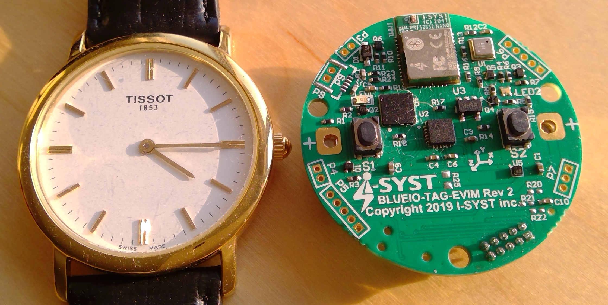

# Travail pratique 1

  L'objectif est de vous initier à la programmation avec le langage C, avec un exemple, un squelette
  de programme existant, la production de tests avec cUnit et la méthode TDD (Test Driven Development).

  De plus, vos sources seront maintenues dans un gestionnaire de version/source de type git.
  
  La compréhension et la prise de décision sont aussi des objectifs à atteindre durant la mise en oeuvre
  , la réalisation, de vos travaux.

## Sujet

Chaque session nous avons un sujet unique que nous traînons pendant les 15 semaines.  Cette fois encore,
je continue avec cette bonne habitude.  L'avantage est que nous n'avons pas à apprendre des sujets différents
pour chaque travail pratique.  Ainsi nous pouvons vraiment concentrer l'effort sur ce qui est important, 
c'est-à-dire la construction et la maintenance de logiciels.  Pour nous c'est avec le langage C.  Un langage
de programmation important qui produit des logiciels dits performants, mais il n'en serait rien sans des
programmeurs qui savent ce qu'ils font.

TCV est un projet d'actualité, qui veut dire : tous contrent le virus (ou les virus).  Nous allons tenter ensemble
de réaliser des programmes qui vont permettre de lutter et prévenir dans un temps très court la dispersion du virus.
Concrètement vous allez programmer un module (un Beacon) qui traite de l'information reçue et qui réagit en émettant
à son tour des transactions.

#### Un éméteur Beacon


## Description du travail

  Le programme `tp1.c` doit tester à l'aide de la librairie `cUnit` toutes variantes des fonctions suivantes :
  
   + Valider la température humaine : validerTH_X
   + Valider la température ambiante : validerTA_X
   + Valider la pulsation : validerPulsation_X
   + Valider le Signal : validerSignal_X
  
  contenues dans les fichiers :
  
   + objet : `tcv.o`;
   + entête : `tcv.h`.
  
  Le rôle du programme `tp1.c` et de son exécutable est de tester et afficher les noms des tests
  (fonctions) qui échouent et qui passent. Ainsi, il sera possible d'affirmer sans doute qu’elles
  sont les fonctions utilisables (fiables).
  
  Il y aura **une** fonction de test (cUnit) pour chacune des fonctions `contenues/listées/à tester` dans tcv.h.
  
   + c'est-à-dire : il y a un `test_nom_de_la_fonction` par fonction ex. : `test_validerSignal_1`;
  
  Il y aura sûrement plusieurs *assert* pour chacune des fonctions afin de tester tous les cas possibles.

  Le programme exécutable `tp1` doit être lancé en ligne de commande avec la syntaxe suivante :
```bash
$ ./tp1
```

#### Vous devez réaliser le travail selon les contraintes suivantes:

- Les fichiers d'entête standard sont tous permis. Tel que `#include <stdio.h>`;
- Vous devez utiliser les fichiers `tcv.h` et `tcv.o` qui sont fournis dans `tp1.zip`;
- `cUnit` est une librairie non standard (car elle ne fait pas du langage C de base) qui est utilisée pour ce travail;
- Les questions devront toutes être posées dans le forum de discussion GitHub section *Issues*;
- Une demande de solutions (réponse), comment faire ceci ou cela sera considéré comme un plagiat;
- Une branche nommée `testunitaire` sera produite et votre travail sera livré dans cette branche;
> > - La simplicité de vos livrables est exigée.  Aucun code ésotérique ne sera accepté.

> > Définition :
> > + ésotérique : Se dit d'un mode d'expression, d'une œuvre qui n'est compréhensible que des initiés;
> >
> > Synonyme :
> > + mystérieux : Qui est incompréhensible ou inexplicable;

Source : Larousse FR

#### Critère d'évaluation pour les fonctions
 - Température humaine
   + +17.0C @ +40.0C
 - Température ambiante
   + -40.0 @ +40.0
 - Pulsation par minutes
   + 50 @ 200 
   + [info](https://www.livescience.com/42081-normal-heart-rate.html)
 - Signal RSSI
   + -25 @ -85 
   + [info](https://dzone.com/articles/formula-to-convert-the-rssi-value-of-the-ble-bluet)
 
 **NOTE les valeurs sont inclusives.**

## Makefile

  Il est obligatoire d'inclure un fichier `Makefile` dans votre projet pour
  faciliter la compilation et les autres actions requises. Celui-ci doit
  minimalement offrir les services suivants :

- Lorsqu'on entre simplement `make`, l'exécutable `tp1` doit être produit
  (ou mis à jour), avec les arguments suivants (obligatoire) : 
  `-Wall -Werror=vla -pedantic -std=c11`;

- Lorsqu'on entre `make clean`, le projet revient dans son état d'origine, c'est-à-dire
  son état lors de la récupération initiale;

- Lorsqu'on entre `make lib`, le téléchargement du fichier 
  https://github.com/guyfrancoeur/INF3135_A2020/raw/master/tp/tp1.zip
  se fait de façon automatique dans un répertoire (./data). Par la suite, la décompression
  est nécessaire;

- Lorsqu'on entre `make test` le programme tp1 s'exécutera.

### Complément

+ `-std=c11` indique au compilateur de traiter le code selon le standard C11 (2011) (et donc 
de rejeter certaines extensions comme celles de GNU par exemple)
+ `-pedantic` permet de signaler les avertissements, ou warnings, selon la norme ISO
+ `-Wall` permet de signaler un grand nombre d'autres warnings décrit dans le man gcc.
En effet, la grande permissivité de C réduit l'aide du compilateur (lorsqu'il n'y a pas d'option)
pour traquer certaines erreurs et les mauvaises pratiques de programmation.

## .gitignore

+ Votre projet (dépôt distant) ne doit pas contenir de fichiers `objet` ou `binaire`.

## liste.sh

 Votre programme exécutable `tp1` affiche beaucoup de choses lorsqu'il est lancé.  Le fichier nommé `liste.sh`
 recevra via stdin le stdout de `tp1`. Le rôle de `liste.sh`, produire uniquement les noms des fonctions qui sont
 valides et fonctionnelles. Il y aura certainement plusieurs fonctions qui vont être listées.
 
 ##### exemple de sortie
 ```
 validerSignal_4
 validerTA_9
 ```

## README.md

  Votre projet doit contenir un fichier nommé `README.md` qui décrit le contenu et qui **respecte le
  format Markdown**. Il doit minimalement contenir les informations ci-bas :

~~~~
   # Travail pratique 1

   ## Description

   <description du projet en quelques phrases>
   <mentionner le contexte (cours, sigle, université, etc.)>

   ## Auteur

   <prénom et nom> (<code permanent>)

   ## Fonctionnement

   <expliquez brièvement comment faire fonctionner votre projet, en inscrivant
   au moins deux exemples d'utilisation (commande lancée et résultat affiché)>

   ## Contenu du projet

   <décrivez brièvement chacun des fichiers contenus dans le projet (une phrase
   par fichier)>

   ## Références

   <citez vos sources ici>

   ## Statut

   <indiquez si le projet est complété ou s'il y a des bogues>
   
   ## Autoévaluation
   
   <mon travail vaut quelques points en fonction du barème>
~~~~

# Remise

  La totalité de votre travail doit être remise au plus tard le **18 octobre 2020 23h59 HE (Québec)**.
  Après cette date, une pénalité de **5 points par jour** de retard sera appliquée.

  La remise se fait **obligatoirement** par l'intermédiaire de la plateforme `Github https://github.com/` 
  
  **Aucune remise par courriel ne sera acceptée** (le travail sera considéré comme non remis).

  Le nom de votre dépôt doit être `inf3135-a2020` (en minuscules). Vous devez ajouter l'utilisateur
  `guyfrancoeur` comme collaborateur. Ceci permettra récupérer et possiblement de déposer qqc commentaires
  (via un fichier) dans votre projet.

  Votre projet devrait minimalement contenir, à la racine du dépôt, les fichiers de type `Unix/Linux` et `ascii` suivants :

- Un fichier `tp1.c` contenant le code source de votre projet, ainsi que votre fonction `main`;
- Un fichier `README.md` avec le titre du projet, les auteurs, les exemples, etc;
- Un fichier nommé `Makefile` supportant les appels `make`, `make clean`, `make lib` et `make test` ;
- Un fichier nommé `cp.txt` avec votre code permanent en majuscule;
- Un fichier de script bash nommé `liste.sh`;
- Un fichier ``.gitignore``.

  Les travaux seront corrigés sur le serveur Java. Vous devez donc vous assurer
  que votre programme fonctionne **sans modification** sur celui-ci.

# Barème de correction

| Critère | Sous-critère | Points |
| ------- |:------------ | ------:|
| Fonctionnabilité  | tests seront lancés (comparaison binaire)      | 3.0 |
| Bash              | script qui liste les fonctions parfaites       | 1.0 |
| Compilation       | sans avertissement ni erreur                   | 1.0 |
| Récupération      | récupération sans problème et dépôt privée     | 1.0 |
| Branche (git)     | nommée testunitaire (branche de développement) | 1.0 |
| Makefile          | <ul><li>make</li><li>make clean</li><li>make lib</li><li>make test</li></ul> | <ul><li>0.5</li><li>0.5</li><li>0.5</li><li>0.5</li></ul> |
| Markdown          | README.md                                      | 0.5 |
| Professionnel     | :wink: (simple et sans mystère)                | 0.5 |
| **Total**         |                                                | 10  |
